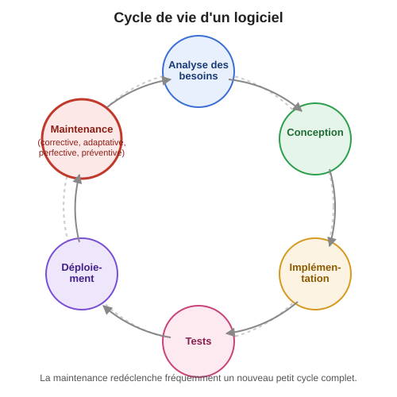
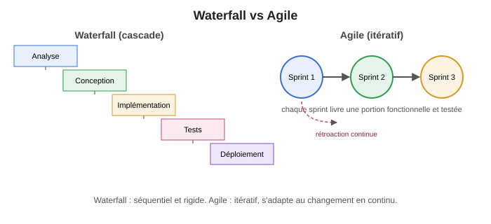

+++
title = "Cycle de vie du logiciel et méthodologies"
weight = 2
+++

## 🔁 Le cycle de vie d'un logiciel

Un logiciel ne s'arrête pas d'exister une fois livré : il traverse un **cycle de vie** complet, qui
se répète en boucle à chaque nouvelle évolution. Les phases classiques sont :

1. **Analyse des besoins** — comprendre le problème à résoudre et les attentes des utilisateurs.
2. **Conception** — définir l'architecture et les choix techniques.
3. **Implémentation** — écrire le code.
4. **Tests** — valider que le logiciel fait ce qui est attendu.
5. **Déploiement** — mettre le logiciel à la disposition des utilisateurs.
6. **Maintenance** — corriger, adapter, améliorer et prévenir, tout au long de la vie du produit.

💡 **Ce qui rend la maintenance différente** : contrairement aux autres phases, la maintenance
n'est pas une étape ponctuelle — elle dure souvent bien plus longtemps que la construction initiale
du logiciel, et elle redéclenche fréquemment un nouveau petit cycle d'analyse → conception →
implémentation → tests → déploiement, à chaque changement demandé.

---

## ⚖️ Waterfall vs Agile face à la maintenance

Les phases du cycle de vie peuvent être organisées selon différents **modèles de processus**. Les
deux plus connus :

### Waterfall (cascade)

Un modèle **séquentiel** : chaque phase doit être complétée avant de passer à la suivante, un peu
comme une cascade d'eau qui ne remonte jamais. Toute la planification se fait en amont.

- ✅ Avantage : structure claire, documentation exhaustive, prévisible sur papier.
- ❌ Inconvénient : très rigide — un problème découvert en test peut forcer à revenir des semaines
  en arrière jusqu'à l'analyse, à un coût très élevé. Peu adapté quand les besoins changent en
  cours de route.

### Agile

Un modèle **itératif** : le logiciel est construit par petits incréments successifs (*sprints*),
chacun livrant une portion fonctionnelle et testée, avec de la rétroaction continue des
utilisateurs à chaque itération.

- ✅ Avantage : s'adapte rapidement au changement, les problèmes sont découverts tôt (à chaque
  sprint) plutôt qu'à la toute fin.
- ❌ Inconvénient : demande une communication constante avec les parties prenantes; moins
  prévisible sur un échéancier fixé très à l'avance.

### Et la maintenance dans tout ça ?

Même en Agile, la maintenance est souvent traitée comme une catégorie à part : les bogues signalés
et les demandes d'amélioration sont généralement priorisés dans le carnet (*backlog*) au même titre
que les nouvelles fonctionnalités, plutôt que d'être remis à une phase de maintenance séparée comme
en Waterfall. C'est une des raisons pour lesquelles l'Agile est aujourd'hui le modèle dominant en
industrie pour les logiciels à longue durée de vie : il traite le changement (dont la maintenance
fait partie) comme la norme plutôt que comme une exception.

> 💡 Pour un rappel des 4 types de maintenance (corrective, adaptative, perfective, préventive) et
> du diagramme en quadrant qui les illustre, voir la page
> [Définition et présentation du concept de maintenance]().
