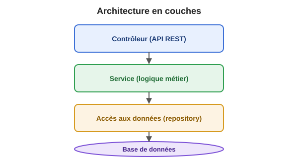

+++
title = "Découverte du projet du cours"
weight = 3
+++

## 🐾 Le projet du cours

Toute la session, vous allez travailler sur une **application existante**, fournie par la personne
enseignante. Ce n'est pas un projet-jouet écrit spécialement pour le cours : il s'agit d'un vrai
projet, avec du code réel, dans lequel des bogues et de la dette technique ont été
intentionnellement laissés ou ajoutés — exactement comme dans un premier emploi où vous héritez
d'un projet imparfait.

### ⚠️ Ce projet contient volontairement des bogues — c'est fait exprès !

Comme dans un vrai emploi de développeur·euse junior, vous héritez d'un code qui n'est **pas
parfait**. Certains comportements sont incorrects par rapport à ce qui est documenté ou attendu.
**Votre travail sera, entre autres, de les découvrir vous-mêmes** au fil de la session (lecture de
code, tests, débogage) — ils ne vous seront pas tous révélés à l'avance. C'est une compétence
professionnelle essentielle : apprendre à ne **jamais faire une confiance aveugle** à du code
existant, même s'il « a l'air » de fonctionner. Un code qui compile et qui semble marcher n'est pas
nécessairement un code correct !

### 🗂️ Tour guidé de la structure du projet

Un projet organisé en couches est très courant en développement logiciel. Voici les dossiers
principaux que vous allez explorer aujourd'hui, avec un exemple typique d'organisation :

```
projet-du-cours/
├── src/main/java/.../model/           → les entités (les "objets" métier du domaine)
├── src/main/java/.../repository/      → l'accès aux données
│                                          C'est la couche qui parle à la base de données.
├── src/main/java/.../controller/      → les points d'entrée de l'API
│                                          C'est ici que sont définies les URLs (endpoints)
│                                          que le monde extérieur peut appeler.
├── src/main/java/.../service/         → la logique métier (les règles, les validations)
├── src/test/java/...                  → les tests unitaires et d'intégration
├── pom.xml                            → configuration Maven (dépendances, plugins de build)
└── README.md                          → documentation d'appoint du projet (à lire en premier !)
```



💡 **Pourquoi cette organisation en couches ?** C'est un des principes fondamentaux qu'on reverra
en détail plus tard dans la session : séparer les responsabilités (accès aux données, règles
métier, exposition de l'API) rend un système plus facile à maintenir, tester et faire évoluer
indépendamment couche par couche.

### 🖥️ C'est quoi, une API REST ? (rappel rapide)

Une **API REST** (*Representational State Transfer*) est une façon standardisée d'exposer des
fonctionnalités et des données sur le web, via des URL et des verbes HTTP :

| Verbe HTTP | Signification | Exemple générique |
|---|---|---|
| `GET` | Lire/récupérer une ressource | `GET /api/ressources` → obtenir la liste des ressources |
| `POST` | Créer une nouvelle ressource | `POST /api/ressources` → créer une nouvelle ressource |
| `PUT` | Modifier une ressource existante | `PUT /api/ressources/3` → mettre à jour la ressource #3 |
| `DELETE` | Supprimer une ressource | `DELETE /api/ressources/7` → supprimer la ressource #7 |

Contrairement à un site web classique, une API REST ne retourne généralement pas de pages HTML,
mais des données structurées (souvent en **JSON**), destinées à être consommées par un autre
programme (une application mobile, un site web séparé, un autre service, etc.).

### 🚀 Installer les prérequis et démarrer l'application

**Étape 0 — Vérifier votre version de Java.** Vérifiez la version de Java exigée par le projet
fourni (consultez sa documentation). Ouvrez un terminal et tapez :

```bash
java -version
```

Si votre version installée est plus ancienne que celle exigée, installez un JDK plus récent avant
de continuer — sinon la construction du projet échouera.

**Étape 1 — Cloner le projet** (voir la page Git de cette semaine si ces commandes ne vous sont pas
familières) :

```bash
git clone <url-du-depot-fourni>
cd <dossier-du-projet>
```

**Étape 2 — Démarrer l'application** (à faire en direct devant la classe) :

```bash
./mvnw spring-boot:run
```

> Sur Windows, utilisez `mvnw.cmd spring-boot:run` (ou `.\mvnw.cmd spring-boot:run` selon votre
> terminal). Le fichier `mvnw` (« Maven Wrapper ») télécharge automatiquement la bonne version de
> Maven pour vous — inutile de l'installer vous-même.

**Étape 3 — Tester l'API** une fois l'application démarrée. Ouvrez votre navigateur (ou un outil
comme `curl` ou Postman) à l'adresse indiquée dans la documentation du projet. Vous devriez voir
une réponse en JSON. 🎉

> 🔎 **Il n'y a pas nécessairement d'interface graphique (GUI)** dans ce type de projet : une API
> REST pure ne comporte pas de pages web à cliquer. Un outil comme **Swagger UI** peut être
> disponible pour générer automatiquement une documentation interactive à partir du code — très
> utile pour tester des requêtes sans écrire de code client. C'est un choix de conception tout à
> fait réaliste : dans une vraie entreprise, l'équipe qui construit le « back-end » (l'API) est
> souvent distincte de l'équipe qui construit le « front-end » (l'interface visuelle que voient les
> utilisateurs finaux) — c'est même considéré comme une bonne pratique d'architecture (les deux
> peuvent évoluer et être déployés indépendamment).

**Ouvrir le projet dans IntelliJ IDEA :** `File > Open`, puis sélectionnez le dossier du projet
(celui contenant `pom.xml`). IntelliJ devrait détecter automatiquement qu'il s'agit d'un projet
Maven et télécharger les dépendances. Pour lancer l'application depuis l'IDE, repérez la classe
contenant la méthode `main` (souvent nommée `*Application`) et cliquez sur la flèche ▶️ verte à
côté.

<details>
<summary>⚠️ Piège fréquent sous IntelliJ : erreur de démarrage liée à un "bean" manquant</summary>

Si vous obtenez une erreur du genre `UnsatisfiedDependencyException ... no bean of type ...`, il
est fréquent que certaines classes soient normalement générées automatiquement à la compilation
(par un outil comme MapStruct ou Lombok) et qu'IntelliJ n'ait pas exécuté les **annotation
processors** nécessaires. Deux solutions :

1. **Recommandé** : `Settings > Build Tools > Maven > Runner` → cocher *"Delegate IDE build/run
   actions to Maven"*.
2. Ou activer explicitement l'annotation processing : `Settings > Build, Execution, Deployment >
   Compiler > Annotation Processors` → cocher *"Enable annotation processing"*.

Dans les deux cas, relancez ensuite un build complet (`Build > Rebuild Project`).
</details>
