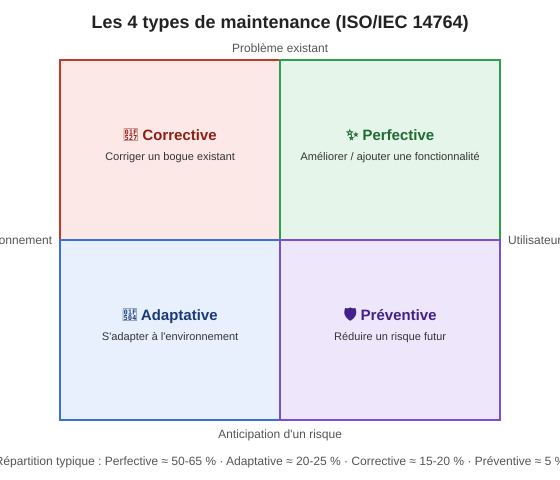

+++
title = "Définition et présentation du concept de maintenance"
weight = 1
+++

Vous avez passé vos sessions précédentes à écrire des projets — parfois seul·e, parfois en équipe —
mais toujours sur du code neuf, démarré from scratch pour les besoins d'un TP, et qui cessait
d'exister (ou presque) une fois la session terminée.

À partir d'aujourd'hui, vous entrez dans le monde réel du développement logiciel :

> 80 % de la carrière d'un·e développeur·euse, ce n'est **pas** écrire du nouveau code — c'est
> comprendre, réparer et faire évoluer du code déjà en place depuis longtemps, souvent
> sous pression, avec une documentation incomplète, sur un système qu'on ne peut pas se permettre
> d'arrêter.

C'est ce qu'on appelle de la **maintenance logicielle**. Un malentendu fréquent : on associe
souvent la maintenance uniquement au « vieux code legacy ». En réalité, la maintenance commence
dès qu'une **première version d'un logiciel est livrée** à un client ou mise en production —
même si le code a été écrit hier. Une équipe qui livre la version 1.0 d'une application neuve
devra, dès le lendemain, corriger les bogues rapportés, l'adapter à un nouvel environnement, ou
répondre aux demandes d'amélioration : c'est déjà de la maintenance, même si le code n'a rien de
« vieux » ou de « legacy » au sens strict.

On appelle plus spécifiquement **code legacy** (ou « code hérité ») du code déjà en production
depuis un certain temps, généralement écrit avec des technologies, des versions de langage ou des
pratiques dépassées par rapport à ce qui se fait aujourd'hui — mais qui doit continuer à
fonctionner et à évoluer. Ce n'est pas seulement « du code que quelqu'un d'autre a écrit » : même
du code que vous avez écrit vous-même peut devenir « legacy » quelques années plus tard, une fois
les technologies utilisées dépassées et le contexte d'origine oublié. Le code legacy est donc un
**cas particulier**, souvent le plus délicat, de code à maintenir — mais la maintenance
elle-même s'applique à **tout logiciel livré**, jeune ou vieux. Bienvenue en
**maintenance logicielle**. 🎓

### 🆚 Ce qui change par rapport à vos cours précédents

| Avant (projets de A à Z) | Maintenant (maintenance) |
|---|---|
| Le projet démarre de zéro à chaque TP | Vous héritez de milliers de lignes déjà écrites, parfois avec des technologies vieillissantes |
| Le code est récent et suit les pratiques enseignées | Le code peut dater de plusieurs années et suivre des pratiques dépassées |
| L'intention derrière le code est fraîche dans la mémoire de l'équipe | L'intention originale est parfois perdue ou mal documentée |
| Le projet dure quelques semaines | Le projet peut vivre des années, voire des décennies |
| Peu ou pas de conséquences si vous cassez quelque chose | Casser une fonctionnalité peut affecter de vrais utilisateurs |

---

## 📚 Les 4 types de maintenance (norme ISO/IEC 14764)

La norme internationale ISO/IEC 14764 (héritière de l'ancienne norme IEEE 1219) définit 4
catégories de maintenance logicielle. C'est la classification de référence en génie logiciel : on
la retrouve dans la plupart des ouvrages (dont *Software Engineering* de Sommerville) et dans les
processus qualité des entreprises (ITIL, CMMI...). Il est important de bien les distinguer, car
elles reviendront tout au long de la session (et à l'épreuve finale !).

Un même changement dans un vrai projet peut d'ailleurs mélanger plusieurs types à la fois — par
exemple, corriger un bogue de sécurité (corrective) peut aussi être vu comme une action préventive
si on en profite pour éliminer toute une famille de bogues similaires. Ne cherchez pas une réponse
« parfaitement pure » à chaque fois : l'important est de comprendre *l'intention dominante* du
changement.

| Type | Définition | Ce qui déclenche le changement | Exemple générique |
|---|---|---|---|
| 🔧 **Corrective** | Corriger un défaut/bogue déjà présent dans le logiciel — le comportement observé ne correspond pas au comportement attendu ou documenté | Un rapport de bogue, un incident en production, un test qui échoue | Un site de commerce en ligne calcule mal la taxe de vente sur certaines commandes; on corrige la formule pour qu'elle reflète le comportement attendu |
| 🔄 **Adaptative** | Adapter le logiciel à un changement de son **environnement** (nouvel OS, nouvelle version d'un langage/framework, nouvelle base de données, nouvelle réglementation...) sans changer la fonctionnalité offerte à l'utilisateur | Une dépendance externe change, devient obsolète, ou n'est plus supportée | Une application mobile doit être adaptée parce qu'Apple ou Google exige une nouvelle version minimale du système d'exploitation pour rester publiable sur le magasin d'applications |
| ✨ **Perfective** | Améliorer le logiciel à la demande des utilisateurs ou de l'équipe — meilleure performance, meilleure lisibilité, meilleure structure interne (sans changer le comportement observable), **ou** ajout de fonctionnalités demandées (qui, elles, changent le comportement observable) | Une demande d'amélioration, un problème de performance, ou simplement le désir de rendre le code plus facile à maintenir | Réusiner (refactoriser) une classe de 2000 lignes en plusieurs classes plus petites et mieux nommées, sans changer ce que le programme fait pour l'utilisateur final |
| 🛡️ **Préventive** | Modifier le logiciel *avant* qu'un problème ne survienne, pour réduire un risque futur (souvent invisible pour l'utilisateur final) | Une analyse de risque, un audit de sécurité, ou une revue de dette technique | Mettre à jour une bibliothèque tierce dès qu'une vulnérabilité de sécurité connue (CVE) est publiée à son sujet, avant qu'elle ne soit exploitée |

📊 **Répartition typique observée en industrie** (proportions couramment citées dans la
littérature, ex. Lientz & Swanson, l'étude qui a popularisé cette répartition) :

- Perfective ≈ 50-65 % — la plus grosse part, contrairement à l'intuition de plusieurs! On
  maintient surtout pour *améliorer*, pas seulement pour réparer.
- Adaptative ≈ 20-25 %
- Corrective ≈ 15-20 %
- Préventive ≈ 5 % — souvent la plus négligée, alors qu'elle coûte le moins cher à long terme.

{}
Avant de continuer, mettez ces définitions en pratique : l'exercice
[Étiqueter les types de maintenance]()
vous fait classifier 6 scénarios réalistes, directement sur cette page.
{}

🧠 Petit truc mnémotechnique pour ne pas les confondre

- **Corrective** = il y a déjà un **bogue** → je répare quelque chose de **cassé**.
- **Adaptative** = le **monde extérieur change** (OS, langage, matériel, loi) → je m'adapte.
- **Perfective** = **rien n'est cassé**, mais je rends le code **meilleur** (lisibilité, performance,
  structure interne — sans changer le comportement observable), **ou** j'ajoute une fonctionnalité
  demandée par les utilisateurs (ce qui, cette fois, change bel et bien le comportement observable).
- **Préventive** = je répare quelque chose qui **n'est PAS encore cassé**, pour éviter que ça le
  devienne plus tard (comme une vidange d'huile avant que le moteur ne brise).

🤔 Testez votre compréhension : à quel type appartient chacun de ces changements ?

1. Une banque met à jour son application pour se conformer à une nouvelle loi sur la protection des
   données personnelles. → **Adaptative** (changement de l'environnement réglementaire).
2. Une application de messagerie plante systématiquement quand un message dépasse 1000 caractères.
   On corrige le bogue. → **Corrective**.
3. Une équipe ajoute des tests automatisés supplémentaires sur un module critique qui n'en avait
   aucun, sans changer son comportement, pour réduire le risque de futures régressions. →
   **Préventive**.
4. Une entreprise simplifie l'architecture interne de son système de facturation pour que les
   futures modifications soient plus rapides à réaliser, sans que les clients ne remarquent de
   différence. → **Perfective**.

---

## 💡 Pourquoi la maintenance coûte-t-elle si cher ?

Statistique classique à retenir : jusqu'à **60-80 %** du coût total d'un logiciel se dépense
**après** sa première mise en production (Sommerville, *Software Engineering*). Autrement dit,
écrire la première version du logiciel n'est souvent que la partie la moins chère de son cycle de
vie complet !

Pourquoi un coût aussi élevé ?

- 🧠 **Perte de connaissance** : les personnes qui ont écrit le code original quittent
  l'entreprise, changent d'équipe, ou oublient simplement leurs décisions de design après quelques
  mois.
- 📉 **Dette technique qui s'accumule** : chaque raccourci pris « pour aller plus vite » aujourd'hui
  ralentit un peu plus chaque modification future (on reverra ce concept en détail en semaine 5).
- 🌀 **Complexité qui grandit** : plus un logiciel vit longtemps, plus il accumule de
  fonctionnalités, d'exceptions, de cas particuliers — chaque ajout rend le suivant un peu plus
  difficile.
- 📄 **Documentation incomplète ou périmée** : rarement mise à jour au même rythme que le code.

Même en développement Agile, la maintenance est souvent perçue comme la phase la moins
« glamour » — mais c'est justement celle qui bâtit la réputation d'un·e développeur·euse senior :
n'importe qui peut écrire du code neuf sur une page blanche, peu de gens savent réparer et faire
évoluer un système vivant sans le casser. 💪

---

## 📖 Petit glossaire de la semaine

| Terme | Définition courte |
|---|---|
| **Code legacy** | Code existant, déjà en production, écrit par quelqu'un d'autre (ou par vous, il y a longtemps) |
| **Dette technique** | L'ensemble des raccourcis/compromis pris dans le code, qui ralentiront les changements futurs |
| **Code smell** | Un indice visuel/structurel qu'une partie du code pourrait poser problème, sans être nécessairement un bogue |
