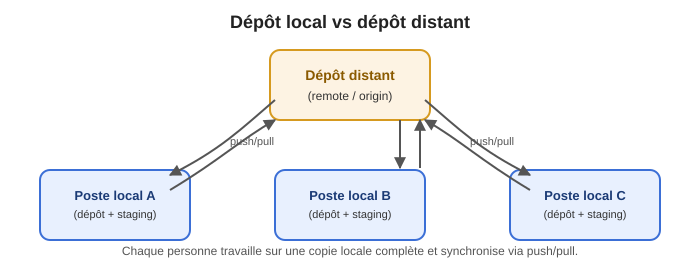
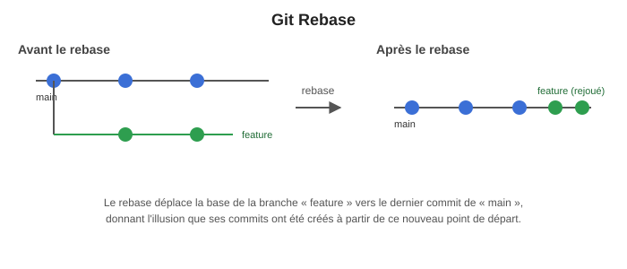

+++
title = "Introduction à Git (1/2)"
weight = 4
+++

Git est le logiciel de contrôle de version que vous avez déjà utilisé dans vos cours précédents.
Cette semaine, on en fait un rappel complet.

### Qu'est-ce que Git ?

Git est un logiciel de contrôle de version. Il permet de gérer des fichiers et leur évolution dans
le temps. Il permet de retracer l'origine de chaque modification, de rétablir des versions
précédentes, et permet l'intégration de modifications effectuées en parallèle.

### Concept

Le principe d'un gestionnaire de version est qu'il gère un document comme « une base » à laquelle
est ajoutée une suite de modifications.

Il y a un **dépôt commun** (remote) et les contributeurs travaillent sur des **versions locales**.

Lorsqu'un·e contributeur·rice a réalisé une modification qui est prête à être envoyée, il/elle
**pousse** (push) celle-ci vers le dépôt. Le dépôt garde la trace avec un identifiant unique.

Git est en fait un gestionnaire de version **décentralisé**. Il y a 2 dépôts : remote et local. De
plus, il maintient une version brouillon (staged, sandbox) sur le poste local.



### Git clone

Lorsque vous devez récupérer le code de votre repository (dépôt remote) :

```bash
git clone https://github.com/<votre-org>/<votre-projet>.git
```

Si vous avez configuré la clé SSH dans GitHub par exemple :

```bash
git clone git@github.com:<votre-org>/<votre-projet>.git
```

### Git Commit

Le principe de la commande `commit` est de déposer les modifications sur un dépôt **local**. Il
faut également être vigilant au niveau de la branche utilisée pour le commit. De plus, il est
important de mettre souvent à jour la branche avant de procéder à un commit.

Lorsqu'on fait la commande `commit`, on doit y ajouter un message. En entreprise, on joint souvent
un identifiant pour référer à la tâche en cours. Après cet identifiant, on peut y mettre une
description. Par exemple :

```
PRJ-3428 : Ajout de tests unitaires sur la méthode du service getClients
```

Lorsqu'on relie l'identifiant et les commits, on peut alors connaître le travail effectué dans le
code pour une tâche donnée dans le système de gestion des projets (Jira, ClickUp, Zoho, ZenHub,
Asana, Monday.com, etc.).

```bash
git commit -m "Votre message"
```

### Git Push

La commande `git push` permet de pousser (la branche actuelle du) local vers le remote : Git
applique alors successivement tous les commits au remote.

Il est fortement recommandé de faire un `git fetch`/`pull` avant de procéder à celui-ci — à moins
d'être seul·e dans ce repository et/ou la branche visée.

### Git Fetch, pull

La commande `git fetch` permet de récupérer l'état courant du remote (nouveaux commits, nouvelles
branches) et de mettre à jour les références locales (ex. `origin/main`) — **sans toucher** à votre
copie de travail. Après un `fetch`, votre branche courante reste inchangée : vous pouvez inspecter
ce qui a changé (`git log origin/main`) avant de décider quoi faire.

La commande `git pull` va un peu plus loin : elle fait un `fetch`, puis **intègre automatiquement**
ces nouveaux commits à votre branche courante (on verra un peu plus loin, avec `git merge`, ce que
« intégrer » veut dire concrètement).

📌 **Pensez à vous mettre à jour avant chaque session de travail !** C'est la première chose qu'un·e
développeur·euse fait chaque matin en se mettant au travail, dans beaucoup de cas.

### Git status

La commande `git status` vous permet de connaître l'état courant de vos copies locales (les
modifications ont-elles été commitées, les fichiers ajoutés, les commits poussés).

Les interfaces graphiques (dont IntelliJ) vous l'indiquent souvent par des couleurs et des icônes.

### Git logs

La commande `git log` vous permet de voir tous les commits et tous les identifiants (Commit ID)
pour chaque commit effectué. Ces commits peuvent être fort utiles pour faire d'autres commandes
telles que `git revert`, `git cherry-pick`, pour ne nommer que celles-ci.

### Git merge

Cette commande permet d'appliquer les changements (fusionner) d'une autre branche à votre branche
sélectionnée dans votre repository local. Il y a souvent des conflits lors d'une fusion — surtout
si vous avez travaillé dans un même fichier qu'un·e de vos collègues.

Vous devez tenter de résoudre les conflits avec des outils en ligne de commande ou à l'aide d'une
interface graphique. C'est une habileté à acquérir avec le temps. C'est parfois très complexe et si
l'opération n'est pas effectuée avec soin, il peut y avoir **injection de bogue**.

```bash
# on va sur la branche principale
git checkout main

# on fusionne notre branche de travail dans main
git merge ma-branche-travail
```

### Git Rebase

Le rebase consiste à changer la base de votre branche d'un commit vers un autre, donnant
l'illusion que vous avez créé votre branche à partir d'un commit différent.



```bash
git rebase <base>
```

### Git stash

Lorsque vous voulez sauvegarder l'état actuel de votre répertoire de travail, c'est possible de le
faire avec `git stash`, et de revenir à un répertoire de travail propre sans ces modifications.
Vous pourrez ensuite récupérer ce travail en utilisant le nom que vous lui aurez donné. Vous pouvez
en avoir plusieurs sauvegardés dans une liste.

```bash
# Sauvegarder les changements courants
git stash

# Récupérer les changements précédents
git stash pop

# Voir la liste des stash
git stash list
```

### 🏆 Meilleures pratiques

1. Ne pas laisser les branches inactives. Effacer votre branche de *bugfix* ou de *fonctionnalité*
   si vous avez terminé.
2. Ne pas prendre une branche pour plusieurs fonctionnalités à la fois. **Séparez vos tâches** en
   plus petites et faites des commits **plus souvent**.
3. Récupérer la branche parent le plus souvent possible — soit en faisant un merge, soit en
   faisant des rebases.
4. **Communiquez avec votre équipe** vos intentions ! Ne travaillez pas sur les mêmes modules si
   possible.
5. Dans chaque Pull Request, vous devriez ajouter des tests unitaires si vous avez travaillé sur
   une fonctionnalité ou un correctif.
6. Avant une mise en production, créez une branche à partir de `main` (ex. `MEP_4OCT_26`),
   fusionnez-y la branche RELEASE visée, assurez-vous que tout compile et que les conflits sont
   déjà résolus — le jour J, il ne reste qu'à fusionner cette branche vers la production.

### Gitflow

Pour maintenir une certaine cohésion en entreprise, un modèle de branches a été proposé : le
**Gitflow**. Il implique de séparer les branches de développement et les branches primaires
déployées dans de multiples environnements.

📎 Source : [Atlassian — Comparing Workflows: Gitflow](https://www.atlassian.com/git/tutorials/comparing-workflows/gitflow-workflow)

### 📚 Références

- Richard E. Silverman (2013), *Git Pocket Guide*, O'Reilly
- Alice Jacquot, *Introduction à Git* — https://www.lri.fr/~jacquot/ipo/introAGit.pdf

### Récapitulatif des commandes essentielles pour cette semaine

```bash
git clone <url>          # récupérer une copie locale complète du dépôt distant (une seule fois)
git checkout <branche>   # se déplacer sur une branche existante
git checkout -b <nom>    # créer une nouvelle branche à partir de la branche actuelle, et s'y déplacer
git status               # voir l'état actuel de vos fichiers (modifiés, en attente, etc.)
git add .                # mettre en attente ("stage") les fichiers modifiés
git commit -m "message"  # enregistrer un instantané (snapshot) local de vos changements
git push                 # envoyer vos commits locaux vers le dépôt distant (remote)
git pull                 # récupérer et fusionner les changements du dépôt distant
```

### Exemple concret : créer votre branche de travail d'équipe

```bash
git checkout main
git checkout -b equipe-3-exploration
```

Ceci crée une nouvelle branche `equipe-3-exploration` à partir de la branche de départ `main`, sans
jamais modifier directement le code de départ fourni par l'enseignant·e. C'est une règle d'or : **on
ne modifie jamais `main` directement**, on travaille toujours sur sa propre branche.

{}
Mettez ces commandes en pratique tout de suite, en équipe, directement dans le projet legacy : le
[Défi Git — semaine 1]()
vous fait cloner le dépôt, créer une branche, faire des commits, pousser vos changements — et
répondre à quelques questions défi pour valider vos réflexes (pas de pull request pour l'instant,
ça viendra en semaine 2).
{}

### 📝 Convention de messages de commit

En entreprise, un message de commit clair et cohérent facilite énormément la vie de toute l'équipe
(et la vôtre, dans 3 mois, quand vous ne vous souviendrez plus pourquoi vous avez fait ce
changement !). On adoptera cette convention simple pour la session :

```
<CONTEXTE/TP> : <description courte au présent>

Exemple :
TP1 : Correction du bogue de comparaison sur les identifiants de client
```
