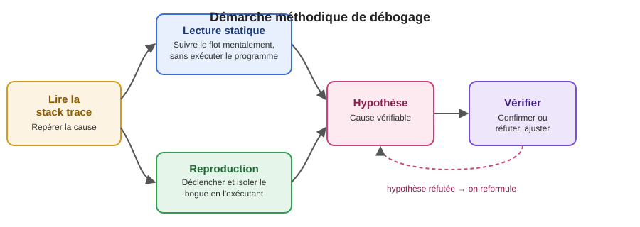

+++
title = "Techniques de débogage (1/2)"
weight = 3
+++

Cette semaine, on entame la première moitié d'un cycle en deux temps sur le débogage
méthodique — la suite (semaine 3) approfondira l'utilisation du débogueur pas à pas. Ici, on pose
les bases : comment aborder un bogue de façon systématique plutôt qu'en devinant au hasard.

### 🐞 Déboguer, ce n'est pas deviner

Face à un bogue dans du code que vous n'avez pas écrit, la tentation est grande de changer une
ligne « pour voir si ça règle le problème ». C'est rarement efficace, et ça peut même **injecter
un nouveau bogue** sans qu'on comprenne pourquoi. Le débogage méthodique suit plutôt une démarche
proche de la **méthode scientifique**, popularisée par Andreas Zeller dans *Why Programs Fail: A
Guide to Systematic Debugging* — une référence de fond en génie logiciel sur le sujet.

Il n'y a **pas une seule marche à suivre obligatoire** — deux stratégies d'investigation
complémentaires existent, et vous choisissez celle qui convient selon le cas (on peut aussi
passer de l'une à l'autre en cours de route) :

1. **Lire la pile d'appels** (stack trace), quand il y en a une, pour localiser où le problème se
   manifeste.
2. **Investiguer** — soit en **lisant le code et en suivant le flot mentalement** (débogage
   *statique*), soit en **reproduisant et isolant** le bogue en l'exécutant (débogage
   *dynamique*) — selon ce qui est le plus rapide et le plus fiable dans votre situation.
3. **Formuler et tester des hypothèses** sur la cause réelle, jusqu'à confirmation.



---

## 1️⃣ Lire la pile d'appels (stack trace)

Quand une exception n'est pas gérée, le programme affiche une **pile d'appels** (stack trace) :
la liste des méthodes qui étaient en train de s'exécuter, de la plus récente (en haut) à la plus
ancienne (en bas), au moment où l'erreur est survenue. C'est souvent le tout premier indice
disponible, avant même d'avoir ouvert un seul fichier.

### Anatomie d'une stack trace Java

```
java.lang.NullPointerException: Cannot invoke "String.length()" because "client.getNom()" is null
    at ca.cegepmv.legacy.service.ClientService.validerNom(ClientService.java:42)
    at ca.cegepmv.legacy.service.ClientService.creerClient(ClientService.java:27)
    at ca.cegepmv.legacy.controller.ClientController.creer(ClientController.java:18)
    at java.base/jdk.internal.reflect.NativeMethodAccessorImpl.invoke0(Native Method)
    ...
Caused by: java.sql.SQLException: Column 'nom' cannot be null
    at ca.cegepmv.legacy.repository.ClientRepository.insert(ClientRepository.java:55)
    ... 12 more
```

| Élément | Ce qu'il signifie |
|---|---|
| Première ligne (`java.lang.NullPointerException: ...`) | Le type d'exception + un message souvent très utile (ici, Java moderne indique même **quelle expression** était `null`) |
| Chaque ligne `at ...` | Une méthode « empilée » au moment du crash — la **première** ligne `at` est l'endroit exact où l'exception a été levée |
| Ordre des lignes | De la plus **récente** (haut, là où ça a explosé) vers la plus **ancienne** (bas, l'appelant d'origine) |
| `Caused by:` | Une **cause racine** différente, souvent plus utile que l'exception du dessus, qui n'était qu'une conséquence |
| `... 12 more` | Le reste de la pile est identique à l'exception précédente — Java l'abrège pour ne pas la répéter |

### 🎯 Stratégie de lecture

1. **Ne paniquez pas devant un mur de texte.** Cherchez d'abord s'il y a un `Caused by:` — c'est
   souvent **la vraie cause**, pas la première ligne affichée.
2. Repérez la **première ligne `at` qui appartient à votre propre code** (pas à une bibliothèque
   ou au JDK) — c'est généralement le point de départ le plus utile pour investiguer.
3. Lisez le **message** de l'exception, pas seulement son type : `NullPointerException` seul ne
   dit pas grand-chose, mais « `client.getNom()` is null » vous dit exactement quelle valeur
   manquait.
4. Notez le **fichier et le numéro de ligne** (`ClientService.java:42`) — c'est votre point
   d'entrée, que vous choisissiez ensuite de le lire statiquement ou d'ouvrir le débogueur
   (approfondi la semaine prochaine).

{}
Mettez cette lecture en pratique tout de suite : l'exercice
[Lire une stack trace]() vous fait décortiquer
quelques piles d'appels réalistes et en tirer des hypothèses.
{}

---

## 2️⃣ Investiguer : lecture statique ou reproduction dynamique

Une fois le point d'entrée repéré (la ligne suspecte), il reste à comprendre **pourquoi** le
problème survient. Deux stratégies complémentaires existent — ni l'une ni l'autre n'est
« la bonne façon obligatoire » de faire; l'expérience vous aide à choisir la plus efficace selon
le cas.

### Lecture statique (suivre le flot mentalement)

Beaucoup de bogues se résolvent **sans jamais exécuter le programme** : vous lisez le code à
partir de la ligne suspecte, vous suivez les appels vers le haut ou vers le bas, et vous repérez
la cause directement (une condition inversée, un `null` évident, un oubli manifeste). C'est
souvent la façon la plus rapide de procéder — surtout pour un·e développeur·se expérimenté·e du
projet — et elle réutilise directement les stratégies vues dans
[Lire le code des autres]() (lecture top-down,
bottom-up, tests comme documentation).

**Quand elle suffit généralement** : la stack trace pointe déjà une ligne précise, le code à cet
endroit est simple à suivre, et une seule cause plausible saute aux yeux.

### Reproduction et isolation dynamique

Dans d'autres cas, la lecture seule ne suffit pas à trancher — il faut **exécuter** le programme
pour observer son comportement réel.

- **Quand la reproduction devient nécessaire** :
  - le comportement **dépend du contexte** (données spécifiques, ordre d'appels, concurrence,
    timing, configuration) et une lecture statique ne permet pas de confirmer la cause avec
    certitude;
  - la lecture du code fait émerger **plusieurs hypothèses plausibles** et il faut trancher entre
    elles;
  - vous devez **prouver que votre correctif règle vraiment le problème** — un bogue « corrigé »
    sans jamais avoir pu le reproduire n'est qu'une supposition non testée.

**Reproduire** :
- Notez les **étapes exactes** qui mènent au problème (quelle requête, quelles données, quel
  ordre d'opérations).
- Notez l'**environnement** : version du logiciel, système d'exploitation, données en base,
  configuration.
- Un bogue rapporté par un·e utilisateur·rice (« ça ne marche pas ») est presque toujours
  incomplet au départ — la première tâche est souvent de poser des questions pour compléter ces
  informations manquantes.

**Isoler (réduire au minimum)** — une fois le bogue reproductible, on cherche à **réduire** le
scénario à sa plus simple expression, ce que Zeller appelle la *simplification* d'un cas d'échec :
- Retirer, une à une, les étapes ou les données qui ne sont pas nécessaires pour que le bogue se
  manifeste encore.
- Se demander : *le bogue apparaît-il aussi avec une seule donnée au lieu de 50 ? Avec un seul
  utilisateur au lieu de plusieurs en concurrence ?*
- Un scénario réduit au minimum est beaucoup plus facile à transformer en **test automatisé de
  régression** (on reverra ce lien avec les tests en semaine 4-5).

> 💡 Un bogue isolé à une seule méthode, avec une seule entrée précise qui le déclenche, est déjà
> à moitié résolu.

**Exemple concret.** Un bogue rapporté ainsi : *« L'export en lot plante parfois, mais pas
toujours. »*

1. **Reproduire** : en posant des questions, on découvre que ça plante seulement quand la liste à
   exporter contient plus de 200 éléments *et* qu'au moins un élément a un champ optionnel vide.
2. **Isoler** : on réduit la liste à 2 éléments (un normal, un avec le champ vide) — le bogue se
   manifeste encore. On a maintenant un cas minimal, reproductible en quelques secondes, au lieu
   d'attendre l'export complet de 200+ éléments à chaque essai.

<details>
<summary>🤔 Testez-vous</summary>

Pourquoi est-ce important d'avoir réduit le cas à 2 éléments plutôt que de continuer à déboguer
directement avec les 200+ éléments d'origine ?

**Réponse** : un cas minimal est plus rapide à ré-exécuter à chaque hypothèse testée (secondes vs
minutes), plus facile à transformer en test automatisé de régression, et élimine le « bruit » — si
un seul élément avec un champ vide suffit à déclencher le bogue, on sait que la taille de la liste
n'est probablement pas la vraie cause.
</details>

{}
Trouvez (ou provoquez) un petit bogue dans votre propre projet. Notez les étapes exactes pour le
reproduire, puis essayez de **réduire** le scénario au minimum (moins de données, un seul appel
au lieu de plusieurs, une seule condition à la fois). Combien d'étapes avez-vous pu retirer sans
que le bogue disparaisse ?
{}

> 🤝 **Les deux se combinent naturellement** : on lit souvent le code d'abord pour se faire une
> première idée, puis on reproduit pour confirmer une hypothèse ambiguë — ou l'inverse, on
> reproduit d'abord pour capturer un scénario, puis on le lit pour comprendre la cause.

---

## 3️⃣ Formuler et tester des hypothèses

Une fois le bogue isolé et la pile d'appels lue, on entre dans la partie la plus proche de la
démarche scientifique — le cœur de l'approche de Zeller, mais qu'on retrouve aussi, sous une forme
plus généraliste, dans *Software Engineering* de Sommerville lorsqu'il aborde la localisation des
défauts (*fault location*) :

1. **Observer** les faits disponibles (message d'erreur, ligne de code, données en entrée).
2. **Formuler une hypothèse** précise et vérifiable : *« Je pense que `getNom()` retourne `null`
   parce que le champ `nom` n'est jamais rempli lors de la création d'un client importé en
   lot. »*
3. **Tester l'hypothèse** de la façon la plus rapide possible : un point d'arrêt, un `log`
   temporaire, un test unitaire ciblé, une valeur affichée dans la console.
4. **Confirmer ou réfuter**, puis raffiner l'hypothèse si elle était fausse — sans jamais
   « corriger à l'aveugle » avant d'avoir confirmé la cause.

> ⚠️ **Piège classique** : corriger le **symptôme** (ex. ajouter un `if (nom != null)` pour éviter
> le crash) sans corriger la **cause réelle** (pourquoi `nom` est `null` en premier lieu) ne fait
> que déplacer le bogue ailleurs — ou le cacher, ce qui est souvent pire.

### 🧭 Petit résumé de la démarche

| Étape | Question à se poser | Outil typique |
|---|---|---|
| Lire la stack trace | Où exactement l'exception a-t-elle été levée ? Y a-t-il un `Caused by` ? | Logs, console, IDE |
| Lecture statique | Est-ce que je peux suivre le flot et trouver la cause juste en lisant ? | Lecture du code, stratégies vues plus tôt |
| Reproduction dynamique | Sinon : puis-je déclencher le bogue à volonté, puis le réduire au minimum ? | Étapes documentées, données de test, élimination progressive |
| Hypothèse | Pourquoi cela se produit-il, précisément ? | Points d'arrêt, logs temporaires, tests ciblés |
| Vérifier | Mon hypothèse est-elle confirmée ? | Ré-exécution du scénario réduit ou nouvelle lecture ciblée |

📚 **Références**

- Andreas Zeller (2009), *Why Programs Fail: A Guide to Systematic Debugging*, 2ᵉ édition, Morgan
  Kaufmann — la démarche « reproduire → isoler/simplifier → formuler une hypothèse → tester » de
  cette page en est directement inspirée.
- Ian Sommerville, *Software Engineering*, chapitre sur la maintenance logicielle et la
  localisation des défauts.
