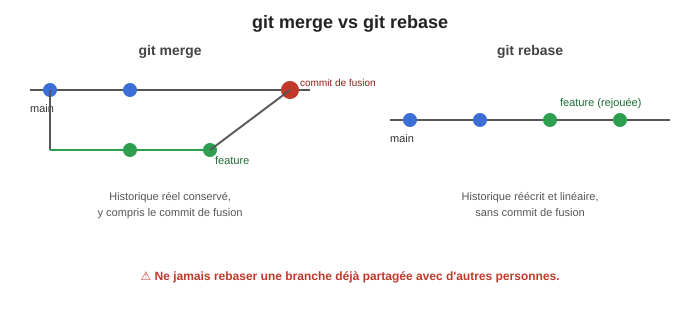
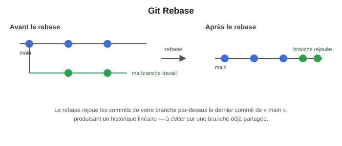
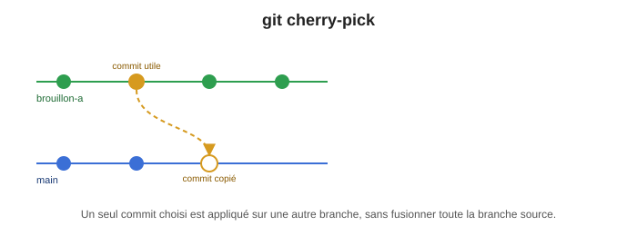

+++
title = "Git 2/2 — notions avancées"
weight = 6
+++

Cette semaine, on poursuit l'introduction à Git amorcée en semaine 1, avec les notions
nécessaires pour collaborer efficacement en équipe : Pull Request, choix entre `merge` et
`rebase`, retour en arrière sécuritaire, et récupération sélective de commits.

## 🎬 Mise en situation

Imaginez : vous et un coéquipier travaillez chacun sur une branche différente pour corriger deux
bogues différents dans le même fichier. Vendredi 16h, vous voulez tout fusionner dans `main` avant
la fin de semaine. Votre coéquipier a *déjà* poussé sa branche. Vous, vous avez 5 commits « oups »,
« correction », « oups2 », « ça devrait marcher », « non attends » sur votre branche.

Que faites-vous ? Nettoyez-vous votre historique avant d'ouvrir une PR ? Fusionnez-vous ou
rebasez-vous ? Et si un conflit apparaît ? Toutes les notions ci-dessous existent pour répondre
précisément à ce genre de situation — pas juste pour le plaisir de mémoriser des commandes.

---

## Cycle de vie dev / test / prod et `git pull --rebase`

Dans un vrai projet, plusieurs environnements coexistent (développement local, intégration/test,
production), et plusieurs personnes travaillent en parallèle sur le même dépôt. Avant de pousser
votre travail, il faut d'abord récupérer l'état le plus à jour de la branche distante.

### Astuce « 1 ligne magique »

```bash
git pull --rebase
```

Cette commande combine en une seule ligne :
- la récupération des commits distants (`fetch`);
- le rebase de vos commits locaux par-dessus (au lieu d'un `merge`, qui créerait un commit de
  fusion supplémentaire).

Résultat : un historique **linéaire**, plus facile à lire, sans commits de fusion inutiles.

---

## Pull Request et revue de code

Une **Pull Request** (PR) est une demande d'intégrer les changements d'une branche vers une autre
(généralement vers la branche principale), accompagnée d'une revue de code par une autre personne
avant la fusion. C'est la pratique standard en industrie pour :

- s'assurer qu'au moins une autre paire d'yeux valide le changement avant qu'il n'entre dans le
  code partagé;
- documenter *pourquoi* un changement a été fait, pas seulement *quoi*;
- déclencher automatiquement les vérifications d'un pipeline CI (build, tests, analyse de qualité)
  avant la fusion.

**Bonnes pratiques pour une PR** :
- Une description claire du problème résolu ou de la fonctionnalité ajoutée.
- Des tests qui démontrent que le changement fonctionne (et ne casse rien d'autre).
- Une taille raisonnable — une PR de 2000 lignes est presque impossible à bien réviser.

---

## `merge` vs `rebase`

Les deux commandes permettent d'intégrer les changements d'une branche dans une autre, mais elles
ne produisent pas le même historique :

| | `git merge` | `git rebase` |
|---|---|---|
| Historique résultant | Conserve l'historique réel, y compris un commit de fusion | Réécrit l'historique pour le rendre linéaire, comme si les commits avaient été faits l'un après l'autre |
| Sécurité | Sûr sur une branche déjà partagée | À éviter sur une branche déjà partagée avec d'autres personnes (réécrit les commits, donc change leurs identifiants) |
| Cas d'usage typique | Fusionner une branche de fonctionnalité terminée dans `main` | Nettoyer/aligner sa propre branche de travail avant d'ouvrir une PR |

```bash
# merge : fusionner une branche dans une autre
git checkout main
git merge ma-branche-travail

# rebase : rejouer les commits d'une branche par-dessus une autre
git checkout ma-branche-travail
git rebase main
```





> ⚠️ **Règle d'or** : ne jamais faire de rebase sur une branche que d'autres personnes ont déjà
> récupérée (`pull`) — cela réécrit l'historique et complique la vie de toute l'équipe.

### Rebase interactif

Le rebase interactif permet de réécrire l'historique de vos propres commits avant de les partager :
regrouper (squash), renommer (reword), modifier (edit) ou même supprimer (drop) des commits.

```bash
git rebase -i HEAD~3
```

Un fichier s'ouvre alors, listant les derniers commits :

```
pick abc123 ajout ligne1
pick def456 ajout ligne2
pick ghi789 correction typo
```

On peut modifier le mot-clé devant chaque commit :

| Mot-clé | Effet |
|---|---|
| `pick` | Garder le commit tel quel |
| `reword` | Garder le commit, mais modifier son message |
| `edit` | S'arrêter sur ce commit pour le modifier |
| `squash` | Fusionner ce commit avec le précédent (en gardant les deux messages) |
| `fixup` | Fusionner ce commit avec le précédent (en jetant son message) |
| `exec` | Exécuter une commande shell à cette étape |
| `drop` | Supprimer complètement ce commit |

Exemple : fusionner un commit de correction de coquille dans le commit précédent, pour garder un
historique propre avant d'ouvrir une PR :

```
pick abc123 ajout ligne1
squash def456 ajout ligne2
fixup ghi789 correction typo
```

---

## Rollback : `revert` vs `reset`

Deux façons différentes d'annuler des changements, avec des implications très différentes :

| Commande | Effet | Sécurité |
|---|---|---|
| `git revert <commit>` | Crée un **nouveau** commit qui annule les changements d'un commit précédent, sans réécrire l'historique | ✅ Sûr, même sur une branche déjà partagée/poussée |
| `git reset --soft HEAD~1` | Supprime le dernier commit, mais garde les changements en attente (staged) | ⚠️ Réécrit l'historique local |
| `git reset --hard HEAD~1` | Supprime le dernier commit **et** ses changements, sans possibilité de récupération facile | ⚠️⚠️ Dangereux — perte de travail possible |

> 📌 En règle générale : préférez `revert` sur une branche déjà partagée/poussée (comme `main`), et
> réservez `reset` à votre travail strictement local, pas encore partagé.

---

## Cherry-pick

`git cherry-pick` permet d'appliquer un commit précis d'une branche sur une autre, **sans fusionner
toute la branche** — utile quand un seul correctif intéressant se trouve au milieu de commits non
désirés.

```bash
git checkout main
git log --oneline ma-branche-travail   # repérer le commit voulu
git cherry-pick <hash-du-commit>
```



---

## Résolution de conflits de merge

### Quand survient un conflit

Git ne peut pas fusionner automatiquement deux branches lorsque **les mêmes lignes d'un fichier ont
été modifiées différemment** dans chacune. Git marque alors le(s) fichier(s) en conflit avec des
marqueurs spéciaux :

```
<<<<<<< HEAD
contenu de notre branche
=======
contenu de l'autre branche
>>>>>>> ma-branche-travail
```

```bash
git status   # voir les fichiers en conflit
```

### Options pour résoudre un conflit

**a) Résolution manuelle**
1. Ouvrir le fichier et choisir ce qu'on garde.
2. Supprimer les marqueurs `<<<<<<<`, `=======`, `>>>>>>>`.
3. Marquer le fichier comme résolu, puis terminer la fusion :
```bash
git add <fichier>
git commit
```

**b) Accepter une version entière**
```bash
# garder notre version
git checkout --ours <fichier>
git add <fichier>

# garder la version de l'autre branche
git checkout --theirs <fichier>
git add <fichier>

git commit
```

**c) Outil visuel**
```bash
git mergetool
```

**d) Abandonner le merge en cours**
```bash
git merge --abort
```

### Résumé rapide

| Situation | Commande |
|---|---|
| Prendre notre version | `git checkout --ours <fichier>` |
| Prendre leur version | `git checkout --theirs <fichier>` |
| Ouvrir un outil visuel | `git mergetool` |
| Annuler le merge | `git merge --abort` |
| Marquer un fichier résolu | `git add <fichier>` |

> 💡 Pour limiter les conflits futurs : privilégiez `git pull --rebase`, communiquez avec l'équipe
> sur les modules touchés, et faites des commits plus petits et plus fréquents.

---

## Commandes utiles à connaître

| Commande | Description |
|---|---|
| `git log --oneline --graph --all` | Historique graphique de toutes les branches |
| `git diff` | Voir les différences non commitées |
| `git show <commit>` | Voir le détail d'un commit précis |
| `git branch -a` | Lister les branches locales et distantes |
| `git switch <branche>` | Changer de branche (alternative moderne à `checkout`) |
| `git add -p` | Mettre en attente ses changements par morceaux (staging partiel) |
| `git stash` | Mettre de côté temporairement des changements non commités (ex. pour changer de branche rapidement) |
| `git stash pop` | Réappliquer les changements mis de côté avec `git stash` |

---

## 🧪 À pratiquer

La théorie ne suffit pas : voir le [Défi Git — semaine 2]()
pour un exercice guidé, en équipe de 2, qui vous fait provoquer et résoudre un vrai conflit de
merge, ouvrir une Pull Request, comparer `merge`/`rebase`, tester `revert`/`reset` et pratiquer
`cherry-pick` — directement dans le projet legacy du cours.
