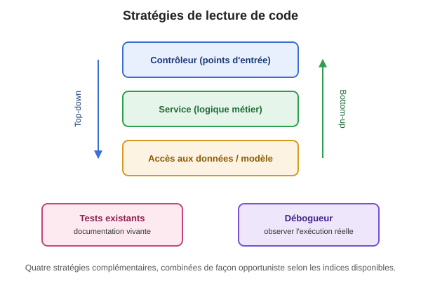

+++
title = "Lire le code des autres"
weight = 1
+++

## Ce que veut dire « comprendre » du code

Avant de voir les stratégies concrètes, clarifions ce qu'on cherche à construire quand on lit du
code : un **modèle mental** — une compréhension du fonctionnement du système et des raisons qui
expliquent ses choix de conception. Ce n'est pas juste "avoir lu les lignes", c'est être capable
d'expliquer et de prédire le comportement du code sans le relire.

Pour construire ce modèle mental, deux types de connaissances entrent en jeu :

- **La connaissance de programmation** (*programming knowledge*) : les concepts généraux,
  indépendants du projet — comment fonctionne une boucle, un design pattern, une injection de
  dépendances, une API REST. C'est ce que votre formation vous donne déjà.
- **La connaissance du domaine/du système** (*domain/system knowledge*) : les connaissances
  spécifiques à *votre* projet — ce que représentent ses entités métier dans le domaine qu'il
  couvre, et comment ses couches en particulier sont organisées (nommage des packages, découpage
  contrôleur/service/accès aux données, conventions maison).

La recherche montre qu'un bon mélange des deux, et pas seulement une expertise générale en
programmation, est associé à une meilleure compréhension de code inconnu. C'est pourquoi lire
*seulement* le code, sans jamais consulter la documentation disponible (README, spécification
d'API, tickets liés), limite votre compréhension — combiner les deux est plus efficace que l'un ou
l'autre isolément.

Votre **niveau d'expertise** influence aussi la stratégie la plus efficace : les novices ont
tendance à lire plus séquentiellement, ligne par ligne, pendant que les programmeurs expérimentés
reconnaissent des motifs familiers (structures de contrôle, patterns d'architecture) et peuvent
« sauter » directement aux parties pertinentes. Ne soyez donc pas surpris·e si une stratégie
top-down très efficace pour un développeur expérimenté du projet vous demande, à vous, plus
d'aller-retours au début — c'est normal, et ça s'améliore avec la pratique.

## Stratégies de lecture de code

Lire du code écrit par quelqu'un d'autre est une compétence à part entière, distincte de l'écriture
de code. On ne lit pas du code existant comme on lirait un roman, du début à la fin — on choisit
une **stratégie d'attaque** selon ce qu'on cherche à comprendre. Voici quatre stratégies
complémentaires, que vous pouvez combiner selon la situation — d'ailleurs, la recherche montre que
les programmeurs expérimentés ne suivent presque jamais une seule stratégie de façon rigide : ils
naviguent de façon **opportuniste** entre elles selon les indices disponibles (c'est le cœur du
modèle intégré de von Mayrhauser & Vans, voir la section Références plus bas).

Ces quatre stratégies s'appliquent à **n'importe quel projet, dans n'importe quel langage** — Java,
C#, Python, JavaScript, etc. Adaptez simplement les outils concrets (raccourcis d'IDE, commandes de
recherche) à votre environnement.

### 1. Lecture top-down (depuis les points d'entrée)

On part des **points d'entrée** du programme — les endpoints d'une API, les contrôleurs, ou
l'interface utilisateur — et on descend progressivement vers les détails d'implémentation
(service, puis accès aux données).

- **Quand l'utiliser ?** Quand vous voulez comprendre *ce que fait* le système dans son ensemble,
  avant de vous soucier *comment* il le fait. C'est la stratégie naturelle quand on découvre un
  projet pour la première fois, ou quand on doit ajouter une nouvelle fonctionnalité accessible
  depuis l'extérieur (ex. un nouvel endpoint).
- **Comment procéder concrètement ?** Repérez d'abord un point de repère textuel qui identifie
  précisément la fonctionnalité qui vous intéresse — un chemin d'URL, un libellé affiché à
  l'écran, un message d'erreur, une clé de configuration — puis faites une **recherche globale**
  de ce texte dans tout le projet (recherche « Find in Path » de votre IDE, ou `grep -r` en ligne
  de commande). Cette technique — chercher un « point de repère » plutôt que de lire le code
  séquentiellement — est documentée par Michael Feathers dans *Working Effectively with Legacy
  Code* comme l'une des façons les plus fiables de s'orienter dans du code inconnu, quel que soit
  le langage ou le framework.

  Une fois le point d'entrée repéré (un contrôleur, un gestionnaire de requête, une fonction
  d'interface), suivez chaque appel vers la couche suivante (le service métier, puis l'accès aux
  données) jusqu'à atteindre la source de la donnée (base de données, fichier, appel externe).

  ⚠️ **Attention aux frameworks qui génèrent du code** : certains projets définissent leurs
  endpoints dans un fichier de spécification (ex. une spécification OpenAPI/Swagger, un fichier de
  routage déclaratif) plutôt que directement par annotation sur chaque méthode. Si une recherche
  de mots-clés d'annotation habituels (ex. les annotations de routage de votre framework) ne donne
  rien dans le contrôleur, vérifiez s'il existe un fichier de spécification ou de configuration
  central qui décrit les routes — c'est souvent là que se trouve la correspondance exacte entre
  une méthode et son verbe HTTP/chemin.
- **Risque à éviter** : s'arrêter au premier niveau sans descendre assez loin, et se faire une
  fausse idée du comportement réel (ex. croire qu'une validation existe au contrôleur alors
  qu'elle est en fait dans le service, ou l'inverse).

💡 **Aller plus loin — lire par hypothèses, avec des "beacons"** : Ruven Brooks (1983) propose un
modèle plus général de la lecture top-down : on part d'une **hypothèse de haut niveau** sur ce que
fait le code (ex. « cette méthode doit lister les éléments disponibles »), puis on la **vérifie**
en cherchant des *beacons* — des indices reconnaissables dans le code qui confirment ou infirment
l'hypothèse. Si un *beacon* attendu est absent, c'est le signal qu'il faut creuser plus
profondément ou reformuler l'hypothèse.

**Les beacons ne sont pas tous du même type** — apprendre à les reconnaître accélère beaucoup la
lecture :

- **Beacons sémantiques (nommage)** : le nom d'une classe, d'une méthode ou d'une variable révèle
  son intention. `getResources`, `findAllResources`, `isValid`, `hasExpired` sont des beacons
  sémantiques — ils vous disent *quoi* sans que vous ayez à lire le corps. Un mauvais nommage
  (`process()`, `doStuff()`, `data2`) prive le lecteur de ce signal, ce qui est d'ailleurs l'une des
  raisons pour lesquelles un mauvais nommage est considéré comme un *code smell*.
- **Beacons structurels (patrons de code reconnaissables)** : une forme de code familière suggère
  un algorithme ou un patron connu, même sans commentaire — deux boucles imbriquées avec un
  échange suggèrent un tri; une fonction qui s'appelle elle-même avec un cas de base suggère de la
  récursion; un `try/catch` autour d'un seul appel suivi d'un retour de valeur par défaut suggère
  une stratégie de gestion d'erreur « best effort ».
- **Beacons de framework (annotations, conventions)** : dans les frameworks modernes, des
  annotations ou des conventions de nommage jouent aussi le rôle de beacons — `@GetMapping` révèle
  qu'une méthode répond à une requête HTTP GET, un nom de classe se terminant par `...Repository`
  ou `...Controller` révèle son rôle architectural même avant d'en lire le contenu.
- **Beacons discursifs (documentation)** : commentaires, Javadoc/docstrings, messages de commit et
  README. Utiles quand ils existent et sont à jour — mais rappelez-vous (section précédente) que
  la documentation peut mentir ou devenir obsolète, alors que le code, lui, est toujours exécuté
  tel qu'il est écrit.

**Exemple concret.** Prenons une méthode typique d'un contrôleur qui expose une liste de
ressources :

```java
@GetMapping("/resources")
public ResponseEntity<List<ResourceDto>> getResources() {
    List<Resource> resources = this.service.findAllResources();
    if (resources.isEmpty()) {
        return new ResponseEntity<>(HttpStatus.NOT_FOUND);
    }
    return new ResponseEntity<>(mapper.toDtoCollection(resources), HttpStatus.OK);
}
```

Vos *beacons* ici : le nom `getResources` + `@GetMapping` confirment l'hypothèse « cette méthode
liste des ressources ». L'appel à `findAllResources()` confirme que le contrôleur délègue au
service. Le `mapper` confirme la séparation entre modèle interne (`Resource`) et format exposé
(`ResourceDto`).

<details>
<summary>🤔 Testez-vous</summary>

Un utilisateur signale que l'API retourne toujours `404`, même si vous êtes certain·e qu'il y a des
données en base. En lisant seulement cette méthode, à quelle couche chercheriez-vous en priorité :
contrôleur, service, ou accès aux données ? Pourquoi ?

**Réponse** : le contrôleur ne fait que réagir à ce que `findAllResources()` lui retourne — le
bogue est donc soit dans le service (une logique de filtrage trop stricte), soit encore plus bas,
dans l'accès aux données (une requête mal construite). Le contrôleur lui-même est le suspect le
moins probable ici, puisqu'il ne contient aucune logique métier.
</details>

{}
Choisissez **une fonctionnalité réelle** de votre projet (un endpoint, une commande, un écran).
Repérez son point d'entrée, puis descendez la chaîne d'appels jusqu'à la source de la donnée.
Notez en 4-5 lignes : le point d'entrée trouvé, les *beacons* qui ont confirmé chaque étape, et la
couche où finit vraiment le traitement (base de données, fichier, appel externe, calcul en
mémoire...). Combien de fichiers avez-vous dû ouvrir ?
{}



### 2. Lecture bottom-up (depuis le modèle de données)

On part des **entités/du modèle de données** (les classes qui représentent les objets métier,
souvent dans un dossier `model/` ou équivalent) et on remonte progressivement vers les couches
supérieures (accès aux données → service → contrôleur) en cherchant partout où chaque classe/champ
est utilisé.

- **Quand l'utiliser ?** Quand vous cherchez à comprendre une **structure de données précise** ou
  une **règle métier** (ex. « comment ce champ est-il validé et utilisé dans tout le système ? »),
  ou quand vous devez **ajouter un nouvel attribut** à une entité existante et devez retracer tous
  les endroits qu'il faut mettre à jour en conséquence.
- **Comment procéder concrètement ?** Ouvrez la classe modèle qui vous intéresse, notez ses champs
  et méthodes, puis utilisez la recherche de votre IDE (« Find Usages ») sur la classe pour voir
  **tous les endroits du projet** qui l'utilisent.

  ⚠️ **Attention aux implémentations multiples** : certains projets (surtout des projets
  pédagogiques ou en transition technologique) contiennent **plusieurs implémentations
  concurrentes** d'une même interface (ex. plusieurs façons d'accéder aux données), dont une seule
  est réellement active selon un fichier ou une variable de configuration (profil actif,
  variable d'environnement, indicateur de fonctionnalité). Avant de remonter depuis une entité,
  **vérifiez toujours quelle implémentation est réellement active** dans la configuration du
  projet — sans quoi vous risquez de lire (et de modifier !) du code mort.
- **Risque à éviter** : oublier un endroit d'utilisation (ex. un objet de transfert ou un mapper
  qui duplique un champ) et introduire une incohérence entre la donnée interne et ce qui est
  exposée à l'extérieur ; ou, comme ci-dessus, perdre du temps sur une implémentation qui n'est
  même pas active.

**Exemple concret.** Vous ajoutez un champ à une entité existante :

```java
public class Resource {
    private String name;
    private String description;  // ← nouveau champ
    // getters/setters...
}
```

Une recherche « Find Usages » sur `Resource` révèle typiquement 3-4 endroits à mettre à jour : la
requête d'accès aux données (si elle liste explicitement des colonnes), le DTO exposé à
l'extérieur, le mapper qui convertit l'un vers l'autre, et les tests qui vérifient le tout.

<details>
<summary>🤔 Testez-vous</summary>

Après avoir ajouté `description`, le test du **mapper** échoue, mais celui du **contrôleur**
continue de passer. Qu'est-ce que cela vous apprend sur l'endroit où se situe l'oubli ?

**Réponse** : le mapper ne transfère probablement pas encore le nouveau champ vers le DTO. Le test
du contrôleur passe quand même parce qu'il ne vérifie sans doute pas ce champ précis — un succès
« trompeur » qui illustre bien pourquoi une suite de tests incomplète peut masquer un oubli.
</details>

{}
Choisissez **une entité/un modèle de données** central de votre projet. Sans encore modifier le
code, faites un « Find Usages » dessus et dressez la liste de tous les fichiers qui l'utilisent
(requêtes, DTO, mapper, tests...). Si vous ajoutiez réellement un champ, combien de ces fichiers
faudrait-il modifier ? Y a-t-il un endroit que vous auriez pu oublier si vous n'aviez pas fait cette
recherche systématique ?
{}

### 3. Utiliser les tests existants comme documentation vivante

Un bon test unitaire ou d'intégration montre souvent, **mieux qu'un commentaire ou qu'un README**,
ce que le code est censé faire — y compris les cas limites (valeurs nulles, listes vides, erreurs
attendues) qu'un commentaire mentionne rarement. Michael Feathers appelle ce type de test un
*characterization test* : un test qui documente le comportement **réel** du code existant, plutôt
que son comportement souhaité.

- **Quand l'utiliser ?** Avant même d'ouvrir le code de production, quand une classe de test
  existe déjà pour la classe qui vous intéresse. C'est particulièrement utile pour comprendre le
  comportement *attendu* d'une méthode sans avoir à déchiffrer son implémentation interne.
- **Comment procéder concrètement ?** Ouvrez le fichier de test correspondant à la classe qui vous
  intéresse, et lisez **seulement les noms des méthodes de test et leurs assertions principales**
  avant de lire l'implémentation. Un bon nom de test (ex. suivant une convention du type
  `<action>_<condition>_<résultat attendu>`) dit déjà beaucoup à lui seul : quel scénario est
  testé, et quel comportement est attendu en sortie (succès, erreur, valeur précise).

  Exemple générique de ce qu'on peut apprendre de deux tests, sans lire une seule ligne du code de
  production correspondant :

  ```java
  @Test
  void getResource_existant_retourne200EtLesDonnees() { /* ... */ }

  @Test
  void getResource_inexistant_retourne404() { /* ... */ }
  ```

  Ces deux seuls noms de méthode vous apprennent déjà : le comportement attendu sur succès (`200`
  + données) et sur échec (`404` si la ressource n'existe pas) — sans avoir lu l'implémentation.
- **Risque à éviter** : une suite de tests incomplète ou obsolète peut aussi **mentir** — les tests
  documentent ce qui est *vérifié*, pas nécessairement tout ce que fait réellement le code.
  Restez critique : un test qui n'existe pas ne veut pas dire « ce cas n'existe pas », seulement
  « ce cas n'est pas protégé ».

{}
Trouvez une classe de test de votre projet. Lisez **seulement les noms des méthodes** (cachez ou
ignorez le corps) et écrivez sur papier ce que vous pensez que chaque test vérifie. Ouvrez ensuite
le corps des tests : aviez-vous raison ? Repérez un cas limite (erreur, valeur nulle, liste vide)
qu'un simple README n'aurait probablement pas mentionné.
{}

### 4. Suivre un flux d'exécution réel avec le débogueur

Plutôt que de deviner en lisant seulement le code statique, on pose un **point d'arrêt**
(*breakpoint*) et on observe l'état réel des variables pendant que le programme s'exécute — souvent
plus rapide et plus fiable que de « lire dans sa tête » un enchaînement d'appels complexe.

- **Quand l'utiliser ?** Quand le chemin d'exécution est difficile à suivre juste en lisant (trop
  de couches, de conditions, de polymorphisme), ou quand vous n'êtes pas certain·e que le code lu
  correspond réellement à ce qui s'exécute (ex. plusieurs implémentations possibles d'une même
  interface selon une configuration active — voir la mise en garde de la lecture bottom-up
  ci-dessus).
- **Comment procéder concrètement ?** Posez un point d'arrêt à l'endroit du contrôleur (ou
  équivalent) où l'appel vers la couche service commence, démarrez l'application en mode **Debug**,
  puis déclenchez une vraie requête (via l'interface de test intégrée du framework, `curl`, ou un
  client REST comme Postman/Insomnia). Utilisez ensuite *Step Into* pour entrer dans chaque couche
  successive (service, puis accès aux données). Le panneau **Variables** de votre débogueur permet
  d'inspecter l'état réel des objets à chaque étape — et, surtout, de voir la **vraie classe
  concrète** derrière une interface (survolez la variable ou regardez le type affiché entre
  parenthèses). C'est souvent le seul moyen fiable de confirmer laquelle des implémentations est
  réellement branchée, quand une simple lecture du code ne suffit pas.
- **Risque à éviter** : s'arrêter uniquement à observer sans noter ce qu'on apprend — gardez une
  trace de vos observations (même sur papier), sinon il faut tout refaire la prochaine fois.

{}
Posez un point d'arrêt à l'entrée d'une fonctionnalité de votre projet, lancez-la en mode Debug, et
déclenchez-la réellement (appel API, clic, commande...). Faites *Step Into* d'une couche à l'autre
et notez : le nom de la vraie classe concrète derrière chaque interface, une valeur de variable qui
vous a surpris, et un endroit où le code fait autre chose que ce que vous aviez deviné en le
lisant seulement.
{}

---

## Premier repérage guidé de code smells

Sans encore utiliser le vocabulaire officiel (il sera présenté en détail plus tard dans la
session), voici une grille de lecture simple à utiliser en équipe sur quelques classes de votre
projet :

| Question à se poser en lisant | Smell potentiel |
|---|---|
| Cette méthode fait-elle plus de 20-30 lignes ? | *Long Method* |
| Est-ce que je vois le même bloc de code ailleurs dans le projet ? | *Duplicate Code* |
| Cette méthode a-t-elle plus de 4 paramètres ? | *Long Parameter List* |
| Est-ce que je dois ouvrir 3-4 fichiers différents pour comprendre UNE fonctionnalité ? | Faible cohésion / logique éparpillée |
| Le nom de la méthode/variable dit-il vraiment ce qu'elle fait ? | Mauvais nommage (base de tout refactoring) |

⚠️ **Précision importante** : « devoir ouvrir plusieurs fichiers pour *comprendre* une
fonctionnalité » n'est **pas** la définition du smell *Shotgun Surgery* — c'est le symptôme d'une
**faible cohésion** (une logique éparpillée entre plusieurs classes). *Shotgun Surgery* est un smell
qui se manifeste plus précisément au moment de **modifier** le code : un seul changement conceptuel
vous oblige à faire de petites retouches dans un grand nombre de classes différentes. En pratique,
une logique éparpillée que vous avez du mal à *lire* aujourd'hui est souvent le signe avant-coureur
d'un futur *Shotgun Surgery* le jour où il faudra la *modifier* — mais les deux ne sont pas
synonymes. On y reviendra en détail avec le vocabulaire officiel plus tard dans la session.

Consignez vos observations en équipe — ce sera la matière première réutilisée plus tard dans la
session lors de l'introduction formelle du catalogue des code smells et du réusinage.

---

## 📚 Références

- Ruven Brooks (1983), *Towards a theory of the comprehension of computer programs*, International
  Journal of Man-Machine Studies — le modèle des hypothèses et des *beacons* en lecture top-down.
- A. von Mayrhauser & A.M. Vans (1995), *Program comprehension during software maintenance and
  evolution*, IEEE Computer — le modèle intégré de compréhension de code, combinant les stratégies
  top-down, bottom-up et par reconnaissance de motifs de façon opportuniste.
- Michael Feathers (2004), *Working Effectively with Legacy Code*, Prentice Hall — techniques
  d'orientation dans du code inconnu (points de repère textuels, *characterization tests*).
