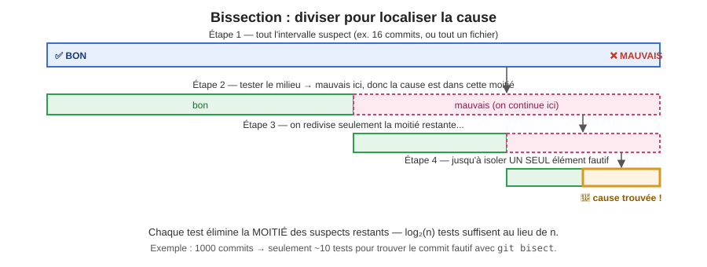

+++
title = "Techniques de débogage (2/2)"
weight = 1
+++

En semaine 2, vous avez appris la **méthode** : reproduire, isoler, lire la stack trace, formuler
une hypothèse. Cette semaine ajoute les **outils** qui rendent chaque étape rapide : le débogueur
pas à pas, les breakpoints conditionnels, une journalisation propre, et la bissection pour localiser
une cause sans tout lire ligne par ligne.

---

## 1️⃣ Le débogueur pas à pas

Un **breakpoint** (point d'arrêt) suspend l'exécution à une ligne précise; vous inspectez alors
l'état réel du programme (variables, pile d'appels) au lieu de le deviner. La documentation
officielle d'IntelliJ IDEA résume la démarche générale en 3 étapes, peu importe l'IDE utilisé :

1. **Définir où le programme doit s'arrêter** — un ou plusieurs breakpoints.
2. **Lancer le programme en mode Debug** (application, test unitaire, ou tout code exécutable).
3. **Examiner l'état du programme suspendu**, puis avancer pas à pas (*stepping*) pour observer
   comment cet état évolue à chaque ligne.

| Action | IntelliJ IDEA | VS Code |
|---|---|---|
| Poser/retirer un breakpoint | Clic dans la marge, ou `Ctrl+F8` | Clic dans la marge, ou `F9` |
| Démarrer en mode Debug | `Shift+F9` | `F5` |
| *Step Over* (ligne suivante, sans entrer dans les méthodes appelées) | `F8` | `F10` |
| *Step Into* (entrer dans la méthode appelée) | `F7` | `F11` |
| *Step Out* (sortir de la méthode courante) | `Shift+F8` | `Shift+F11` |
| Reprendre l'exécution normale | `F9` | `F5` |

**Exemple — tiré du projet `spring-petclinic-rest`.** `OwnerRestControllerV1.addPetToOwner`
construit un `Pet` à partir du JSON reçu (`PetFieldsDto`), puis le transmet au service :

```java
// OwnerRestControllerV1.java
@Override
public ResponseEntity<PetDto> addPetToOwner(Integer ownerId, PetFieldsDto petFieldsDto) {
    Owner owner = this.clinicService.findOwnerById(ownerId);
    ...
    Pet pet = petMapper.toPet(petFieldsDto);
    owner.setId(ownerId);
    pet.setOwner(owner);
    pet.getType().setName(null);
    this.clinicService.savePet(pet);
    ...
}
```

Dans ce test, `ClinicService` est remplacé par un **mock** (`@MockitoBean`) : seul le code du
contrôleur ci-dessus s'exécute réellement — l'appel `this.clinicService.savePet(pet)` ne fait rien
(le mock l'intercepte). C'est donc dans le contrôleur qu'il faut poser le breakpoint pour observer
`pet`.

Démarche : posez un breakpoint sur la ligne `pet.getType().setName(null);`, démarrez le test
`OwnerRestControllerV1Tests#testCreatePetSuccess` en Debug, puis *Step Over* pour observer `pet`
dans le panneau **Variables** : dépliez-le pour voir son champ `type` (un `PetType`), qui contient
l'`id` transmis par le JSON du test. C'est exactement ce genre d'observation — inspecter l'état
réel d'un objet reçu, champ par champ — que le débogueur rend immédiat, sans avoir à ajouter de
logs temporaires.

> 💡 **Watches et Evaluate Expression** — deux fonctionnalités à connaître au-delà du panneau
> Variables : un **Watch** garde une expression précise sous surveillance en permanence pendant
> toute la session (ex. `pet.getName()`, même après plusieurs *Step Over*) ;
> **Evaluate Expression** (`Alt+F8`) exécute une expression arbitraire *pendant* la pause, sans
> modifier le code — utile pour tester une hypothèse (« est-ce que `pet.getOwner()` est bien
> réassigné ? ») sans ajouter puis retirer une ligne de code.

<details>
<summary>🤔 Testez-vous</summary>

Vous voulez savoir si `petMapper.toPet(petFieldsDto)` construit correctement le `Pet` à partir du
JSON reçu (nom, date de naissance, type). Utiliseriez-vous *Step Over* ou *Step Into* sur la ligne
`Pet pet = petMapper.toPet(petFieldsDto);` pour investiguer ?

**Réponse** : *Step Into* — le problème est vraisemblablement **dans la logique de mapping**
elle-même (comment `petMapper` traduit chaque champ du DTO vers l'entité), pas dans les données
reçues en entrée (le JSON envoyé par le test). *Step Over* suffirait si vous vouliez seulement
confirmer que `pet` est non-null après l'appel, sans creuser comment il a été construit.
</details>

---

## 2️⃣ Déboguer un test lancé via Maven (`mvn test`)

Poser un breakpoint dans un test et lancer `mvn test` en ligne de commande **ne s'arrête jamais**
sur ce breakpoint — même si le même test, lancé directement depuis l'IDE, fonctionne très bien
avec le débogueur.

**Pourquoi** : quand Maven exécute vos tests, il le fait dans **un autre processus** que celui de
votre IDE. Votre débogueur ne surveille que le processus de l'IDE — il ne « voit » donc jamais ce
qui se passe dans ce processus séparé lancé par Maven, et vos breakpoints ne se déclenchent pas.

Si le but est simplement de déboguer un test précis, la solution la plus simple reste de le
lancer **directement depuis l'IDE** (clic droit sur la méthode → **Debug**) plutôt que via `mvn` —
ça évite complètement le problème. Avec une version récente d'IntelliJ, cette option fonctionne
normalement; avec une version plus ancienne, il arrive qu'elle échoue et qu'on doive alors passer
par la ligne de commande. Si le test doit **impérativement** être lancé via Maven (ex. pour
reproduire un comportement qui dépend d'options passées en ligne de commande), voici la démarche à
suivre :

1. Démarrez Maven en mode debug — le processus se lance puis **attend** qu'un débogueur s'y
   connecte avant de continuer :
   ```powershell
   .\mvnw.cmd test "-Dmaven.surefire.debug" "-Dtest=NomDeLaClasse#nomDeLaMéthode"
   ```
2. La console affiche un message du genre :
   ```
   Listening for transport dt_socket at address: 8000
   ```
3. Attachez le débogueur au processus en attente : dans IntelliJ, menu **Run → Attach to
   Process…** → repérez dans la liste le processus qui correspond à ce test Maven → cliquez
   dessus.
4. Une fois attaché, le processus Maven reprend son exécution et **s'arrête normalement** sur vos
   breakpoints.

<details>
<summary>🤔 Testez-vous</summary>

Vous posez un breakpoint dans une méthode de test, puis lancez `mvn test` normalement (sans mode
debug) depuis un terminal. Le programme s'exécute jusqu'au bout sans jamais s'arrêter. Pourquoi, et
que devriez-vous faire différemment ?

**Réponse** : Maven exécute les tests dans un processus séparé de celui de l'IDE, donc aucun
débogueur n'y est attaché — le breakpoint est ignoré, pas « manqué ». Il faut soit lancer le
test directement depuis l'IDE, soit démarrer Maven en mode debug
(`-Dmaven.surefire.debug`) et attacher le débogueur à ce processus (**Attach to Process**).
</details>

---

## 3️⃣ Breakpoints conditionnels

Poser un breakpoint classique sur une boucle qui itère sur une grande collection oblige à cliquer
« continuer » de nombreuses fois avant d'atteindre le cas qui vous intéresse. Un **breakpoint
conditionnel** ne s'arrête que lorsqu'une expression booléenne est vraie.

**Comment faire** (IntelliJ et VS Code) : clic droit sur un breakpoint existant → un champ
« Condition » apparaît → entrez une expression Java valide à cet endroit du code.

**Exemple — tiré du projet.** `Owner.getPet(String name, boolean ignoreNew)` parcourt tous les
animaux d'un propriétaire à la recherche d'un nom précis :

```java
// Owner.java
public Pet getPet(String name, boolean ignoreNew) {
    name = name.toLowerCase();
    for (Pet pet : getPetsInternal()) {
        if (!ignoreNew || !pet.isNew()) {
            String compName = pet.getName();
            compName = compName.toLowerCase();
            if (compName.equals(name)) {
                return pet;
            }
        }
    }
    return null;
}
```

Sur un propriétaire avec plusieurs animaux, poser un breakpoint classique sur `String compName =
pet.getName();` s'arrête à **chaque** itération de la boucle. Un breakpoint conditionnel ne
s'arrête que sur l'animal qui vous intéresse :

```
Condition : pet.getName().equalsIgnoreCase("Leo")
```

Le programme s'exécute normalement pour tous les autres animaux, puis s'arrête **exactement** sur
celui nommé « Leo ».

> 💡 Autre usage fréquent avec ce même code : arrêter seulement quand `pet.isNew()` est vrai — utile
> pour observer un cas limite précis (un animal pas encore persisté) sans savoir à l'avance à
> quelle itération il apparaît dans l'ensemble `getPetsInternal()`.

{}
Trouvez une boucle ou une collection dans votre projet (ex. une liste retournée par un endpoint).
Posez un breakpoint conditionnel qui ne s'arrête que sur un élément précis (par identifiant, ou par
une valeur inhabituelle d'un champ). Combien de clics « continuer » avez-vous évités par rapport à
un breakpoint classique ?
{}

---

## 4️⃣ Journalisation stratégique : arrêter d'utiliser `println`

`System.out.println("ici")` est tentant, mais pose 3 problèmes en production :

1. **Aucun niveau de gravité** — impossible de l'activer/désactiver sans modifier le code.
2. **Aucun contexte automatique** — pas d'horodatage, pas de nom de classe, pas de thread.
3. **On oublie de le retirer** — il pollue les logs de production, ou pire, révèle des données
   sensibles.

Un **framework de journalisation** (SLF4J + Logback en Java, le standard de l'industrie) règle ces
trois problèmes avec des **niveaux** :

| Niveau | Usage typique |
|---|---|
| `TRACE` | Détail extrême, désactivé presque toujours (ex. contenu complet d'une requête) |
| `DEBUG` | Informations utiles seulement pendant le développement/débogage |
| `INFO` | Événements normaux notables (ex. « commande #123 créée ») |
| `WARN` | Quelque chose d'anormal mais non bloquant (ex. valeur par défaut utilisée) |
| `ERROR` | Une opération a échoué et nécessite attention |

```java
import org.slf4j.Logger;
import org.slf4j.LoggerFactory;

// ...

private static final Logger logger = LoggerFactory.getLogger(ClinicServiceImpl.class);

@Override
@Transactional
public void savePet(Pet pet) throws DataAccessException {
    logger.debug("Association du PetType id={} au Pet id={}", pet.getType().getId(), pet.getId());
    pet.setType(findPetTypeById(pet.getType().getId()));
    petRepository.save(pet);
    logger.info("Pet id={} sauvegardé avec succès", pet.getId());
}
```

- Le `{}` évite la concaténation de chaînes coûteuse quand le niveau `DEBUG` est désactivé.
- En production, on configure typiquement `INFO` ou `WARN` — les lignes `debug()` restent dans le
  code, prêtes à être réactivées sans redéployer, mais n'encombrent pas les logs normalement.

### Ajouter SLF4J au projet (`pom.xml`)

Si votre projet est déjà un projet **Spring Boot**, SLF4J + Logback sont **déjà inclus
automatiquement** (via `spring-boot-starter-web` ou tout autre starter) — rien à ajouter, l'import
`org.slf4j.Logger` fonctionne directement.

Pour un projet Java **sans** Spring Boot, ajoutez ces deux dépendances dans `pom.xml` (réinvestit
la lecture de `pom.xml` vue plus haut cette semaine) :

```xml
<dependencies>
    <dependency>
        <groupId>org.slf4j</groupId>
        <artifactId>slf4j-api</artifactId>
        <version>2.0.13</version>
    </dependency>
    <dependency>
        <groupId>ch.qos.logback</groupId>
        <artifactId>logback-classic</artifactId>
        <version>1.5.6</version>
    </dependency>
</dependencies>
```

- `slf4j-api` : l'interface (`Logger`, `LoggerFactory`) utilisée dans votre code.
- `logback-classic` : l'**implémentation** qui fait le travail réel (écrire dans la console, un
  fichier, etc.) — SLF4J n'est qu'une façade, il faut toujours une implémentation derrière.

### Rediriger les logs vers un fichier

Par défaut, les logs s'affichent seulement dans la console. Pour les écrire **aussi** dans un
fichier, ajoutez un fichier de configuration `src/main/resources/logback.xml` :

```xml
<configuration>
    <appender name="FICHIER" class="ch.qos.logback.core.FileAppender">
        <file>logs/application.log</file>
        <encoder>
            <pattern>%d{HH:mm:ss.SSS} [%thread] %-5level %logger{36} - %msg%n</pattern>
        </encoder>
    </appender>

    <appender name="CONSOLE" class="ch.qos.logback.core.ConsoleAppender">
        <encoder>
            <pattern>%d{HH:mm:ss.SSS} %-5level %logger{36} - %msg%n</pattern>
        </encoder>
    </appender>

    <root level="INFO">
        <appender-ref ref="CONSOLE" />
        <appender-ref ref="FICHIER" />
    </root>
</configuration>
```

Ce fichier crée (ou complète) `logs/application.log` à chaque démarrage, en plus d'afficher les
mêmes logs dans la console — pratique pour consulter l'historique après coup, ou pour partager un
extrait de log sans capture d'écran.

> 💡 **Projet Spring Boot** (c'est le cas de `spring-petclinic-rest`) : pas besoin de
> `logback.xml` pour un cas simple — ajoutez directement dans `application.properties` :
> ```properties
> logging.level.root=INFO
> logging.level.org.springframework.samples.petclinic=DEBUG
> logging.file.name=logs/application.log
> ```
> La deuxième ligne montre comment activer `DEBUG` **seulement** pour le code du projet (par
> paquetage), en gardant les librairies tierces à `INFO` — évite d'être noyé sous des logs qui ne
> vous concernent pas.

<details>
<summary>🤔 Testez-vous</summary>

Pourquoi `logger.debug(...)` est-il préférable à `System.out.println(...)` même si, au final, les
deux affichent une ligne dans la console pendant que vous déboguez localement ?

**Réponse** : `logger.debug` peut être **désactivé globalement** en production sans toucher au
code (juste la configuration), inclut automatiquement classe/horodatage, et peut être redirigé
(fichier, système centralisé) — `println` ne peut faire aucune de ces trois choses.
</details>

---

## 5️⃣ Bissection : diviser pour localiser

Quand un bogue est « quelque part dans ces 300 lignes » ou « apparu à un moment donné dans les 40
derniers commits », lire séquentiellement est lent. La **bissection** (recherche binaire) élimine
la moitié des suspects à chaque test.



### Bissection dans le code

Commentez/désactivez la **moitié** du code suspect, relancez le scénario reproductible (semaine 2) :
- Le bogue disparaît → la cause est dans la moitié désactivée.
- Le bogue persiste → la cause est dans l'autre moitié.

Répétez sur la moitié restante jusqu'à isoler une seule ligne ou méthode.

### Bissection dans l'historique Git — `git bisect`

Quand un bogue est apparu « à un moment donné » sans qu'on sache dans quel commit, `git bisect`
automatise exactement la même logique sur l'historique :

```bash
git bisect start
git bisect bad                # le commit actuel (HEAD) est mauvais
git bisect good v1.2.0         # ce tag/commit connu était bon
# Git se place automatiquement au commit du MILIEU
# → testez, puis répondez :
git bisect good                # si le bogue N'EST PAS présent ici
git bisect bad                 # si le bogue EST présent ici
# ... Git répète la division par 2 jusqu'à trouver LE commit fautif
git bisect reset               # termine et revient à votre branche de départ
```

Sur 1000 commits, `git bisect` trouve le coupable en environ **10 tests** (log₂ 1000 ≈ 10), au lieu
de tester chaque commit un à un.

> 💡 **Bonus automatisation** : `git bisect run ./test-du-bogue.sh` exécute un script qui retourne
> un code de sortie 0 (bon) ou différent de 0 (mauvais) — Git bisecte alors **tout seul**, sans
> intervention manuelle à chaque étape. Dans un projet Maven comme `spring-petclinic-rest`, ce
> script peut être aussi simple que :
> ```bash
> #!/bin/bash
> ./mvnw test -Dtest=OwnerRestControllerV1Tests#testCreatePetSuccess
> ```
> (le code de sortie de `mvnw` est déjà 0 si le test passe, différent de 0 s'il échoue — rien
> d'autre à écrire).

Ce principe — diviser un espace de recherche en deux pour converger en `log(n)` étapes — est
formalisé par Andreas Zeller sous le nom de *delta debugging* dans *Why Programs Fail* (déjà vu en
semaine 2) : `git bisect` en est une application directe, appliquée à l'historique des commits
plutôt qu'aux données d'entrée.

{}
Choisissez un fichier avec plusieurs commits d'historique. Simulez un `git bisect` : identifiez un
commit « bon » ancien et le commit actuel comme point de départ, puis parcourez manuellement (ou
avec `git bisect start`) pour retrouver un commit précis où un comportement a changé.
{}

---

## 🧭 Petit résumé — quel outil pour quelle situation ?

| Situation | Outil à privilégier |
|---|---|
| Suivre un flux d'exécution précis, étape par étape | Débogueur, *step over/into* |
| Un cas précis au milieu d'une grande collection/boucle | Breakpoint conditionnel |
| Comportement à observer sur plusieurs exécutions, ou en production | Journalisation (`logger.debug`/`info`) |
| Cause « quelque part » dans beaucoup de code ou de commits | Bissection (manuelle ou `git bisect`) |
| Un breakpoint ne s'arrête jamais quand le test est lancé via `mvn test` | Attacher le débogueur au processus Maven (`-Dmaven.surefire.debug` + Attach to Process) |

## 📚 Références

- Andreas Zeller (2009), *Why Programs Fail: A Guide to Systematic Debugging*, 2ᵉ édition, Morgan
  Kaufmann — le concept de *delta debugging* qui fonde la bissection.
- Documentation officielle JetBrains —
  [Debug code (IntelliJ IDEA)](https://www.jetbrains.com/help/idea/debugging-code.html) : la
  démarche générale de débogage (breakpoints → run in debug → examiner l'état → stepping) ainsi
  que les Watches et *Evaluate Expression* présentés plus haut en sont directement tirés.
- Documentation officielle Git — [`git bisect`](https://git-scm.com/docs/git-bisect).
- Documentation SLF4J — [niveaux de journalisation](https://www.slf4j.org/manual.html).
