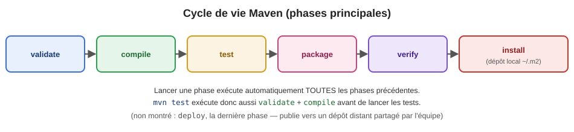

+++
title = "Maven (1/2) — pom.xml, dépendances, plugins"
weight = 3
+++

## Pourquoi un outil de build ?

Compiler, gérer les librairies externes et empaqueter un projet Java « à la main » devient vite
ingérable : chaque librairie a ses propres dépendances (dépendances *transitives*), parfois en
conflit de version entre elles. **Maven** standardise tout ça avec un fichier de configuration
unique — `pom.xml` — et une convention commune, reconnue dans la quasi-totalité des projets Java
d'entreprise.

---

## 1️⃣ Anatomie du `pom.xml`

```xml
<project xmlns="http://maven.apache.org/POM/4.0.0">
    <modelVersion>4.0.0</modelVersion>

    <groupId>ca.cegepmv.legacy</groupId>
    <artifactId>mon-projet</artifactId>
    <version>1.0.0-SNAPSHOT</version>
    <packaging>jar</packaging>

    <properties>
        <maven.compiler.source>17</maven.compiler.source>
        <maven.compiler.target>17</maven.compiler.target>
    </properties>

    <dependencies>
        <dependency>
            <groupId>org.springframework.boot</groupId>
            <artifactId>spring-boot-starter-web</artifactId>
        </dependency>
        <dependency>
            <groupId>org.junit.jupiter</groupId>
            <artifactId>junit-jupiter</artifactId>
            <scope>test</scope>
        </dependency>
    </dependencies>

    <build>
        <plugins>
            <plugin>
                <groupId>org.apache.maven.plugins</groupId>
                <artifactId>maven-compiler-plugin</artifactId>
            </plugin>
        </plugins>
    </build>
</project>
```

| Élément | Rôle |
|---|---|
| `groupId` | Identifiant de l'organisation/projet (convention : nom de domaine inversé) |
| `artifactId` | Nom du module/projet lui-même |
| `version` | Version du projet — `SNAPSHOT` signifie « en développement, pas figée » |
| `packaging` | Type de livrable produit (`jar`, `war`, `pom` pour un module parent) |
| `properties` | Variables réutilisables ailleurs dans le fichier (ex. version de Java) |
| `dependencies` | Librairies externes requises |
| `build > plugins` | Outils qui interviennent pendant le build (compiler, tester, empaqueter...) |

---

## 2️⃣ Dépendances et *scope*

Le `scope` d'une dépendance détermine **quand** elle est disponible :

| Scope | Disponible pour... | Exemple typique |
|---|---|---|
| `compile` *(défaut)* | Compilation ET exécution ET tests | Une librairie utilisée partout (ex. Spring) |
| `test` | Seulement la compilation/exécution des tests | JUnit, Mockito |
| `provided` | Compilation, mais fournie par l'environnement d'exécution (pas empaquetée) | API Servlet sur un serveur qui la fournit déjà |
| `runtime` | Exécution seulement, pas nécessaire pour compiler | Un pilote JDBC |

> ⚠️ Une erreur fréquente : mettre une dépendance de test (ex. JUnit) en `compile` par défaut —
> elle se retrouve alors inutilement empaquetée dans le livrable final.

### Dépendances transitives et conflits de version

Si votre projet dépend de la librairie A, et que A dépend elle-même de la librairie C en version
1.0, mais que votre projet dépend *aussi directement* de C en version 2.0 — lequel des deux Maven
utilise-t-il ? Maven applique la règle du **plus proche dans l'arbre** (*nearest wins*) : la
version déclarée le plus près de votre propre `pom.xml` l'emporte.

```bash
mvn dependency:tree
```

```
[INFO] ca.cegepmv.legacy:mon-projet:jar:1.0.0-SNAPSHOT
[INFO] +- org.springframework.boot:spring-boot-starter-web:jar:3.3.0:compile
[INFO] |  \- com.fasterxml.jackson.core:jackson-databind:jar:2.17.1:compile
[INFO] \- com.mabibliotheque:validation-utils:jar:2.0:compile
[INFO]    \- com.fasterxml.jackson.core:jackson-databind:jar:2.15.0:compile (omitted for conflict)
```

Ici, `jackson-databind` est demandé en **deux versions différentes** (2.17.1 et 2.15.0) par deux
chemins différents — Maven a choisi 2.17.1 (la plus proche) et **ignoré** 2.15.0
(`omitted for conflict`). `mvn dependency:tree` est l'outil de diagnostic à réflexe immédiat
devant tout comportement inattendu lié à une librairie.

{}
Lancez `mvn dependency:tree` sur votre projet. Trouvez une dépendance transitive (une ligne
indentée qui n'est PAS déclarée directement dans votre `pom.xml`) et identifiez quelle dépendance
directe l'a introduite.
{}

---

## 3️⃣ Plugins

Un **plugin** Maven exécute une tâche précise pendant une phase du build. Quelques plugins
omniprésents :

| Plugin | Rôle |
|---|---|
| `maven-compiler-plugin` | Compile le code source (`.java` → `.class`) |
| `maven-surefire-plugin` | Exécute les tests unitaires pendant la phase `test` |
| `maven-jar-plugin` / `spring-boot-maven-plugin` | Empaquette le livrable final (`.jar`) |
| `maven-failsafe-plugin` | Exécute les tests d'intégration (phase `verify`, distincte des tests unitaires) |

---

## 4️⃣ Cycle de vie Maven



| Phase | Ce qui se passe |
|---|---|
| `validate` | Vérifie que le projet est correct et toute l'information nécessaire est disponible |
| `compile` | Compile le code source |
| `test` | Exécute les tests unitaires (`maven-surefire-plugin`) |
| `package` | Empaquette le code compilé (`.jar`/`.war`) |
| `verify` | Vérifie les résultats des tests d'intégration |
| `install` | Installe le livrable dans le dépôt **local** (`~/.m2`), utilisable par d'autres projets locaux |
| `deploy` | Publie le livrable vers un dépôt **distant**, partagé par l'équipe/l'organisation |

**Commandes utiles :**

```bash
mvn clean            # supprime les fichiers générés (dossier target/)
mvn compile           # compile seulement
mvn test              # compile + exécute les tests
mvn package            # compile + teste + empaquette
mvn dependency:tree    # affiche l'arbre complet des dépendances
```

> 💡 Exécuter une phase déclenche **automatiquement** toutes les phases qui la précèdent — `mvn
> package` exécute donc aussi `validate`, `compile` et `test` avant d'empaqueter.

<details>
<summary>🤔 Testez-vous</summary>

Si `mvn test` échoue à cause d'un test qui échoue, `mvn package` va-t-il quand même produire un
`.jar` ?

**Réponse** : non — par défaut, si la phase `test` échoue, Maven **arrête tout le build** et ne
progresse pas jusqu'à `package`. C'est volontaire : livrer un `.jar` dont on sait qu'un test échoue
serait risqué.
</details>

{}
Lancez `mvn clean test` sur votre projet et repérez, dans la sortie console, le rapport Surefire
(généralement dans `target/surefire-reports/`). Combien de tests ont été exécutés ? Y a-t-il des
échecs ?
{}

---

## 📰 Actualité de l'industrie

- **Log4Shell (CVE-2021-44228, décembre 2021)** : une vulnérabilité critique découverte dans
  `log4j`, une dépendance utilisée (souvent transitivement !) par une immense partie de
  l'écosystème Java, a forcé des milliers d'entreprises à auditer en urgence leurs `pom.xml` pour
  savoir si elles étaient exposées — un exemple concret de pourquoi comprendre son arbre de
  dépendances n'est pas juste théorique. On reverra l'analyse automatisée de ce type de risque avec
  Trivy/SonarQube en semaine 9.
- **Outils de surveillance automatique des dépendances** : Dependabot (GitHub), Snyk et OWASP
  Dependency-Check scannent en continu les `pom.xml` des dépôts d'entreprise pour détecter des
  versions vulnérables et proposer automatiquement des mises à jour.
- **Maven vs Gradle** : Maven reste dominant dans l'écosystème Spring/Java d'entreprise (sa
  configuration déclarative en XML favorise la prévisibilité), tandis que Gradle (configuration en
  Groovy/Kotlin, plus programmable) est très répandu en Android et dans certains projets voulant
  des builds plus personnalisés. Les deux appliquent le même concept central : gérer les
  dépendances et automatiser le cycle compilation → tests → empaquetage.

---

## 📚 Références

- Sonatype (2008), *Maven: The Definitive Guide*, O'Reilly Media — référence officielle du plan de
  cours pour Maven.
- Documentation officielle Apache Maven — [maven.apache.org](https://maven.apache.org/guides/introduction/introduction-to-the-lifecycle.html),
  cycle de vie du build.

{}
Poursuivez avec l'[exercice Maven]({}) pour manipuler
`pom.xml` directement dans votre projet.
{}
